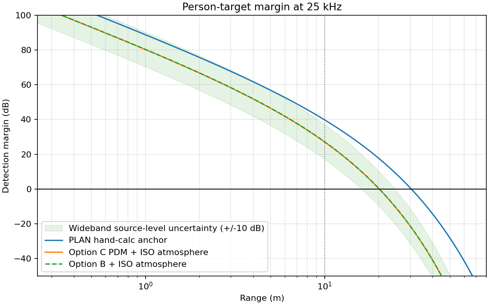
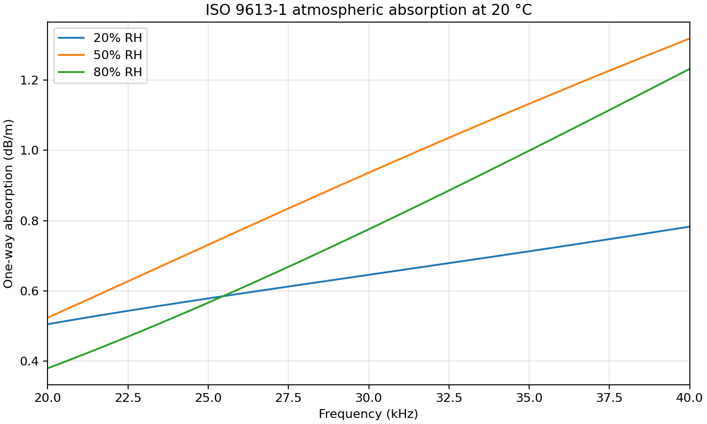
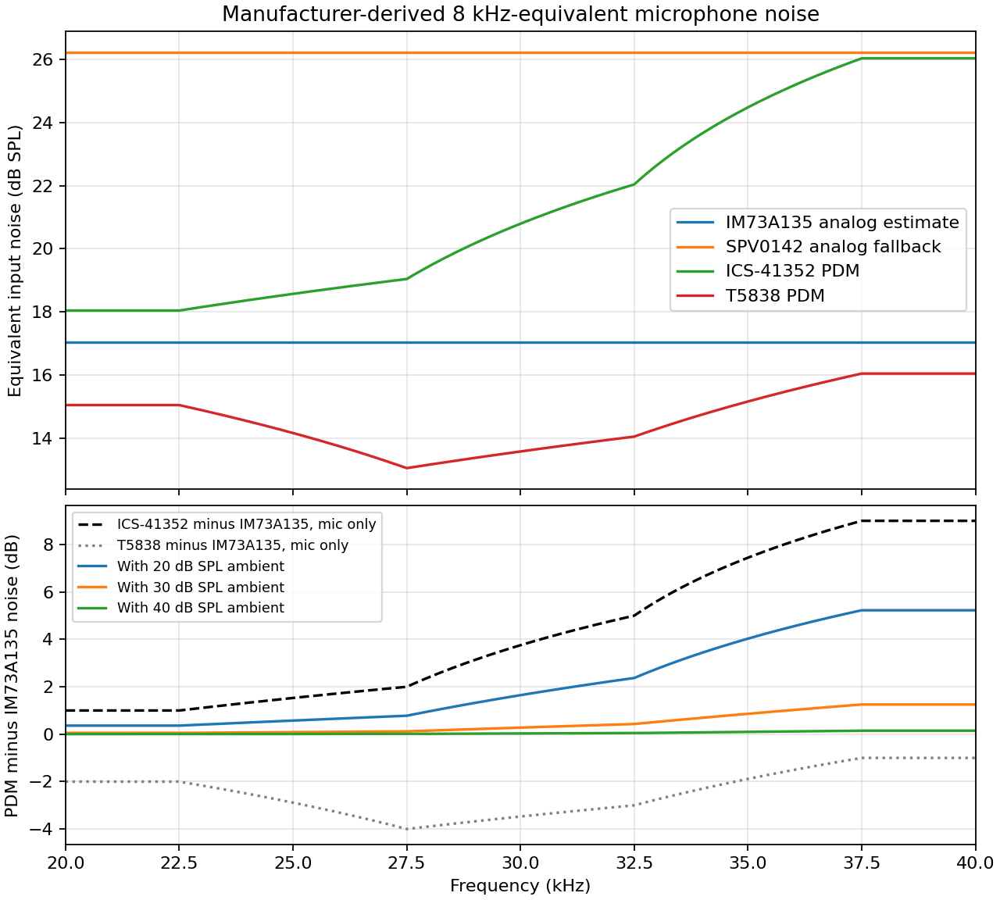
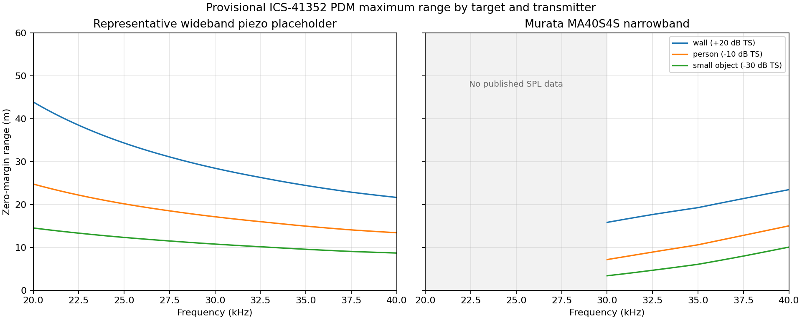
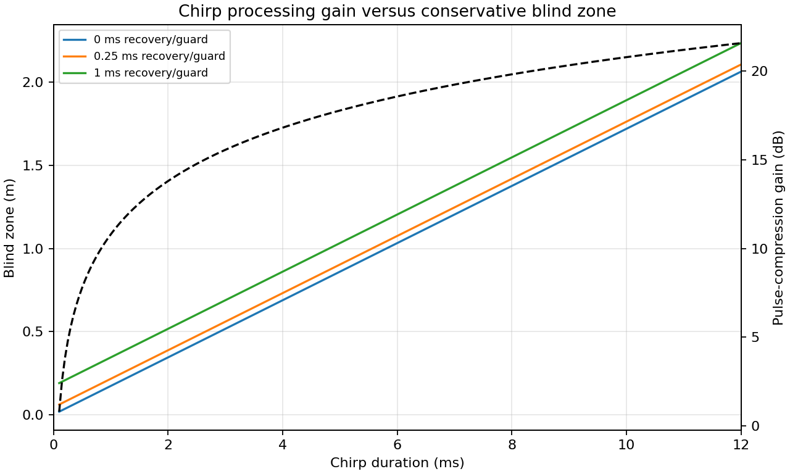

# Sonar v1 link budget

_Generated and checked 2026-08-25. Model: [`link_budget.py`](link_budget.py)._

## Outcome

The PDM architecture is **not nominally SNR-gated for a person at 10 m**. The exact
PLAN anchor evaluates to **+39.8 dB** at 10 m. A provisional reference case, using
ISO atmospheric absorption, a digitized typical ICS-41352 datasheet-noise curve,
and a 104 dB SPL wideband-piezo placeholder, retains **+27.1 dB** at 10 m and reaches
zero margin at **20.2 m**.

The result does not make the acoustic design risk-free. At 25 kHz, a nominal
`TS = -30 dB` small target has only **+7.1 dB** at 10 m. Wideband TX output is still
uncalibrated (the model assigns it ±10 dB), target strength changes sharply with
aspect/material, and correlated noise or reverberation can erase some of the ideal
13.8 dB array gain. Those are the important CP-B measurements.

The provisional ICS-41352 PDM curve is only **2.34 dB noisier** than the IM73A135
analog estimate when microphone self-noise alone is integrated over 20–32 kHz. In
the ticket's 30 dB SPL/8 kHz ambient context, the total penalty falls to **0.15 dB**.
The digitized typical T5838 datasheet curve is quieter than the analog estimate. On
current evidence, D011 should remain in force through the bake-off; PDM noise is not
the reason to reopen it.

## Reference case

| Quantity | Value | Status |
|---|---:|---|
| Frequency / chirp band | 25 kHz / 20–32 kHz | D001 |
| Atmosphere | 20 °C, 50% RH, 101.325 kPa | scenario |
| Source level | 104 dB SPL at 1 m, 10.8 Vrms fundamental | provisional wideband class, ±10 dB |
| Target strength | wall +20, person −10, small object −30 dB | nominal sensitivity inputs |
| Microphone | ICS-41352 digitized typical datasheet curve | provisional Option C reference |
| Ambient noise | 30 dB SPL in 8 kHz, white-scaled to the analysis band | PLAN anchor |
| Array gain | `10 log10(24) = 13.80 dB` | independent-noise ideal |
| Chirp gain | `10 log10(12 kHz × 6.6 ms) = 18.99 dB` | ideal matched filter |
| Detection threshold | 13 dB | engineering requirement |

For a compact point target, the implemented equation is

```text
margin(r) = SL + TS - 40 log10(r / 1 m) - 2 alpha r - NL + PG - DT
```

`SL` uses the airborne reference of 20 µPa. `TS` is stored directly in dB, avoiding
the common 4π ambiguity between differential backscatter area and isotropic sonar
cross section.



## Atmosphere

`atmospheric_absorption_db_per_m()` implements ISO 9613-1's oxygen/nitrogen
relaxation-frequency equations and is parameterized by frequency, temperature,
relative humidity, and pressure. Its regression check reproduces the ISO table
value of 25.8 dB/km at 10 kHz, −20 °C, and 50% RH.

At 20 °C / 50% RH / 101.325 kPa:

| Frequency | One-way absorption |
|---:|---:|
| 20 kHz | 0.524 dB/m |
| 25 kHz | 0.732 dB/m |
| 32 kHz | 1.016 dB/m |
| 40 kHz | 1.318 dB/m |

The PLAN's `alpha = 0.5 dB/m` is plausible (about 0.491 dB/m at 25 °C / 80% RH)
but optimistic for the reference room. At 10 m, replacing 0.5 with 0.732 adds
4.63 dB of round-trip loss. Humidity dependence is non-monotonic: at 20 °C and
25 kHz, attenuation rises from 0.298 dB/m at 10% RH to 0.768 at 40%, then falls to
0.485 at 100%.

Across 20–32 kHz, differential round-trip atmospheric loss at 10 m is 9.84 dB.
The max-range sweep therefore evaluates absorption at each frequency; future
waveform simulation should apply the transfer function per bin rather than use a
single center-frequency coefficient.



## Microphone noise and Option B versus C

ICS-41352 and T5838 manufacturer figures report SNR in 5 kHz ultrasonic bands; the
model converts those to input-referred noise (`80 dB SPL - SNR`). SPV0142 instead
uses its 1.5 kHz near-ultrasonic datum scaled to 5 kHz, while IM73A135 is an
engineering envelope derived from its noise-density and frequency-response plots.
All curves are interpolated and integrated in linear power. Values are typical or
extrapolated, not guaranteed; acoustic-port geometry still requires a physical
bake-off.

| Band | Curve | Mic-only noise | Delta vs IM73 | Total with ambient | Total delta |
|---|---|---:|---:|---:|---:|
| 20–32 kHz | IM73A135 analog | 18.80 dB SPL | 0.00 dB | 31.98 dB SPL | 0.00 dB |
| 20–32 kHz | SPV0142 analog | 28.00 | +9.20 | 33.29 | +1.31 |
| 20–32 kHz | ICS-41352 PDM | 21.15 | +2.34 | 32.12 | +0.15 |
| 20–32 kHz | T5838 PDM | 15.90 | −2.90 | 31.87 | −0.10 |
| 20–40 kHz | IM73A135 analog | 21.02 | 0.00 | 34.19 | 0.00 |
| 20–40 kHz | ICS-41352 PDM | 26.45 | +5.42 | 34.69 | +0.49 |
| 20–40 kHz | T5838 PDM | 18.66 | −2.36 | 34.11 | −0.09 |

ICS-41350 and SPH0641LU4H lack part-specific ultrasonic-noise curves. The model
therefore exposes named ICS-41352 proxy rows for both with ±5 dB uncertainty until
T-002/T-008 resolves lifecycle and the bake-off; the direct ICS-41352 row retains
its separate ±3 dB graph/digitization allowance. This substitution is explicit
ticket coverage, not evidence that ICS-41352 upper-bounds either exact candidate.
T5838 is shown separately rather than silently making the reference case optimistic.



The full generated table, including SPV0142 and curve uncertainties, is
[`microphone-band-summary.csv`](generated/microphone-band-summary.csv).

## Transmitters and target strength

The Murata MA40S4S datum is 120 ±3 dB SPL at 30 cm, 40 kHz, and 10 Vrms sine, or
109.5 ±3 dB at 1 m after spherical spreading. Its response is sharply resonant:
the published curve is roughly 69.5 / 87.5 / 109.5 dB SPL at 1 m for 30 / 35 /
40 kHz. Murata publishes no response below 30 kHz, so the CSV and plot leave
20–29 kHz blank rather than extrapolate it. MA40S4S is a 40 kHz narrowband option,
not the D001 chirp source.

The wideband trace is a **placeholder**, normalized from a legacy calibrated piezo
horn class (92 dB at 2.83 Vrms / 1 m) to 104 dB at the 10.8 Vrms fundamental of a
12 V bipolar square wave. It has a ±10 dB sweep requirement and must be replaced by
a one-metre frequency sweep of the selected part. The Kemo L010 is a reasonable
prototype candidate, but its claimed 120 dB omits distance, frequency, waveform,
and drive, so that number is not used here.

Also feed this constraint into T-013: a 12 V full bridge produces 24 Vpp, above the
MA40S4S's 20 Vpp continuous-square limit. Drive limits are waveform-specific; do
not equate Murata's 10 Vrms sine test with that square-wave limit.

Nominal target-strength inputs are sensitivity parameters, not guaranteed object
properties:

| Target | Nominal TS | Sweep for design review |
|---|---:|---:|
| Person | −10 dB | −20 to 0 dB |
| Small object / 10 cm rigid-sphere class | −30 dB | −40 to −20 dB |
| Wall equivalent | +20 dB | 0 to +35 dB |

A wall is an extended specular reflector, not a range-independent point target;
its line is only an equivalent-TS heuristic at a favorable aspect. Person and small
object values also vary with aspect, clothing, material, and frequency.



Nominal point results are in
[`max-range-summary.csv`](generated/max-range-summary.csv). At 25 kHz with the
wideband placeholder, zero-margin ranges are 34.4 m (wall equivalent), 20.2 m
(person), and 12.4 m (small object).

## Chirp and conservative blind-zone schedule

For a receiver blanked during TX and recovery,

```text
r_blind = c (T_chirp + T_recovery) / 2
range resolution = c / (2 B)
chirp gain = 10 log10(B T_chirp)
```

The board has separate TX and RX elements, so chirp duration is not a fundamental
blind zone if RX stays linear and direct leakage can be cancelled. The table is the
safe burst-then-listen schedule; recovery must be measured. At 12 kHz bandwidth,
ideal range resolution is 1.43 cm; windowing and non-flat TX/RX response will make
roughly 2–3 cm more realistic.

| Chirp | Ideal gain | TX-only blind | 0.25 ms wideband guard | 1.0 ms narrowband guard |
|---:|---:|---:|---:|---:|
| 0.50 ms | 7.78 dB | 0.086 m | 0.129 m | 0.258 m |
| 1.00 ms | 10.79 | 0.172 | 0.215 | 0.344 |
| 2.00 ms | 13.80 | 0.344 | 0.387 | 0.516 |
| 4.00 ms | 16.81 | 0.688 | 0.731 | 0.860 |
| 6.67 ms | 19.03 | 1.147 | 1.190 | 1.319 |
| 8.00 ms | 19.82 | 1.376 | 1.419 | 1.548 |

Suggested acoustic modes (before platform/USB duty-cycle limits):

| Mode | Chirp | Listen range | Approx. minimum PRI / rate |
|---|---:|---:|---:|
| Near | 0.5 ms | 3 m | 19.0 ms / 52.7 Hz |
| Room | 2.0 ms | 10 m | 61.3 ms / 16.3 Hz |
| Long | 6.67 ms | 30 m | 182.6 ms / 5.48 Hz |



The machine-readable scheduler input is
[`blind-zone-schedule.csv`](generated/blind-zone-schedule.csv).

## Running the model

The default verification command is:

```bash
python3 analysis/link_budget.py
```

The script also has PEP 723 metadata for an isolated run:

```bash
uv run analysis/link_budget.py
```

Example sensitivity run:

```bash
python3 analysis/link_budget.py \
  --temperature-c 25 \
  --humidity-percent 80 \
  --bandwidth-khz 12 \
  --chirp-duration-ms 2 \
  --ringdown-ms 0.25 \
  --drive-v-rms 10.8
```

The model contains numerical assertions for the PLAN anchor, the ISO table point,
array/chirp gain, range resolution, the integrated PDM penalty, and the MA40S4S
unpublished-frequency guard.

## Limits

- The max-range plot is a per-frequency sensitivity sweep, not a coherent
  end-to-end chirp simulation.
- Ideal pulse-compression and array gains omit window/filter loss, channel mismatch,
  spatially correlated ambient noise, direct leakage, and room reverberation.
- The source model omits electrical resonance, series damping, amplifier current,
  acoustic compression, beam pattern, and safety/duty-cycle limits.
- Constant target strength and 40-log range loss are far-field point-target
  assumptions. Near-field and extended/specular targets need different models.
- Typical microphone curves and simple white-noise bandwidth scaling are adequate
  for CP-B sensitivity analysis, not final calibration.

## Sources and datasheets

Sources were checked 2026-08-25.

- [ISO 9613-1 atmospheric absorption](https://www.iso.org/standard/17426.html) and
  [equation/table preview](https://cdn.standards.iteh.ai/samples/17426/3a2d69b767024b74805b83b063a91445/ISO-9613-1-1993.pdf)
- [ICS-41352 datasheet](https://product.tdk.com/system/files/dam/doc/product/sw_piezo/mic/mems-mic/data_sheet/ds-000048-ics-41352-data-sheet-v1.0.pdf)
- [ICS-41350 datasheet](https://product.tdk.com/system/files/dam/doc/product/sw_piezo/mic/mems-mic/data_sheet/ds-000047-ics-41350-v1.1.pdf)
- [SPH0641LU4H-1 datasheet](https://www.knowles.com/docs/default-source/model-downloads/sph0641lu4h-1-revb.pdf?Status=Master&sfvrsn=bdc077b1_4)
- [T5838 manufacturer product page and current datasheet](https://www.invensense.tdk.com/en-us/products/microphone/t5838/)
- [SPV0142LR5H-1 datasheet](https://static1.squarespace.com/static/6488b0b8150a045d2d112999/t/67caf41d815fb04909623d2d/1741354016529/SPV0142LR5H-1-datasheet.pdf)
- [IM73A135 datasheet](https://www.infineon.com/assets/row/public/documents/24/49/infineon-im73a135-datasheet-en.pdf)
- [Murata MA40S4S datasheet](https://www.murata.com/~/media/webrenewal/products/sensor/ultrasonic/open/datasheet_maopn.ashx?la=en)
- [Archived CTS piezo application note and product table (reseller-hosted)](https://data.wescomponents.com/Speakers/horntweeters/CTS_Piezo.pdf)
- [TI airborne-ultrasound target cross sections](https://www.ti.com/lit/pdf/SLAA732) and
  [ringing/blind-zone guidance](https://www.ti.com/lit/pdf/SLAA907)
- [Airborne target-strength paper](https://doi.org/10.1016/j.phpro.2010.01.029)
